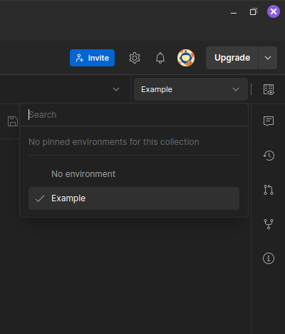

# golang-exercise

  

## Prerequisites

  

Before starting, ensure you have the following installed and set up on your machine:

  

1.  **Docker**: Check if Docker is installed:

```bash

docker --version

```

If not installed, download from here: https://docs.docker.com/get-docker/

  

2.  **Docker Compose**: Check if Docker Compose is installed:

```bash

docker compose --version

```

If not installed, follow instructions here: https://docs.docker.com/compose/install/

  

## Setup

  

1.  **Clone the repository**:

```bash

git clone https://github.com/KiteShi/golang-exercise.git

cd golang-exercise

```

  

2.  **Configure the `.env` file**:

You can either rename the provided `.env_example` file to `.env` for testing purposes or create your own `.env` file in the repository directory. Ensure that it includes all the necessary environment variables:

```dotenv
JWT_KEY=your_jwt_secret_key
ADMINS="your_admin_1:your_password_1,your_admin_2:your_password_2"

POSTGRES_DB=your_database_name
POSTGRES_USER=your_database_user
POSTGRES_PASSWORD=your_database_password

```

These variables are used for configuring JWT secret, admin users, PostgreSQL database connection details, and credentials.

  

3.  **Build and run the services**:

```bash

docker compose up

```

## Usage

  

Here is an example of how to use this project with the Postman tool, which you can download from here https://www.postman.com/downloads/

  

1.  **Install and run Postman on your machine**

2.  **Import collection from repository to Postman**:

- Go to **File** -> **Import...** -> **Create Workspace** (Or choose the existing one). Then press **Continue to Workspace** button, and select ***both collection and environment file*** from the repository.

- Postman collection has name `Golang-exercise.postman_collection.json`.
- Postman environment has name `Example.postman_environment.json`

3. **Make sure that you choose Example environment for this collection**
In the upper right corner choose "Example" environment: 


5.  **Use request explanation for Postman provided below**

  

## Requests Explanation and Examples

  

1.  ### Login POST :8080/login

Route for user authentication.

Note: The credentials provided here are from the `.env_example` file. ***If you have modified it or created your own `.env` file, make sure to use your own credentials.***

**Body (raw):**

```json

{
   "username": "john_doe",
   "password": "X397x@n"
}

```

The response to your request will be:

```json

{
   "token": "your_jwt_token"
}

```

Postman will ***automatically*** set this JWT token in header of next requests (assuming you have selected the correct environment), but you also can do in manually in following request headers *(header name "Authorization", header value "Bearer your_jwt_token")*

  

2.  ### Create company POST :8080/

Creates a new company entry.

***Note: only for authenticated users***

**Body (raw):**

```json

{
   "name": "Company",
   "description": "Just company for example",
   "amount_of_employees": 1234,
   "registered": true,
   "type": "NonProfit"  //one of: Corporations, NonProfit, Cooperative, Sole Proprietorship
}

```

The response will include the company structure with a generated `id` field. Postman will ***automatically*** set this id as `{{id}}` variable in next requests URL  (assuming you have selected the correct environment), but you also can do in manually. In this case copy company `id`, and replace `{{id}}` in request URL with provided `id`.

  

3.  ### Get company by ID GET :8080/{{id}}

Retrieves company information by its `id`.

Note: Postman will automatically populate it with the value from the last "Create company" response (assuming you have selected the correct environment). However, you also have the option to set it manually by replacing `{{id}}` in the URL with the ID of an existing company).

In response you will get company info.

4. ### Patch company PATCH :8080/{{id}}

Updates an existing company entry with specified `id` .

Note: Postman will automatically populate it with the value from the last "Create company" response (assuming you have selected the correct environment). However, you also have the option to set it manually by replacing `{{id}}` in the URL with the ID of an existing company).

***Note: only for authenticated users***

**Body (raw):**

```json

{
   "name": "New name",
   "amount_of_employees": 7,
   "registered": false,
   "type": "Cooperative"
}

```

Note: you don't need to provide all company structure fields.

The response will include the updated company structure.

  

5. ### Delete company DELETE :8080/{{id}}

Deletes a company by its `id`.

Note: Postman will automatically populate it with the value from the last "Create company" response (assuming you have selected the correct environment). However, you also have the option to set it manually by replacing `{{id}}` in the URL with the ID of an existing company).

***Note: only for authenticated users***

This operation will completely remove the company from the database. ***Please note that this action is irreversible.***

In response you will get `HTTP status code 204 No Content.`

  

## Stopping the Services

  

To stop the running services:

```bash

docker  compose  down

```

  

## Additional Commands

  

-  **Running the Linter**:

```bash

docker compose run linter

```

  

-  **Rebuild the services**:

```bash

docker compose up

```

  

-  **Remove all containers and volumes**:

```bash

docker compose down -v

```
